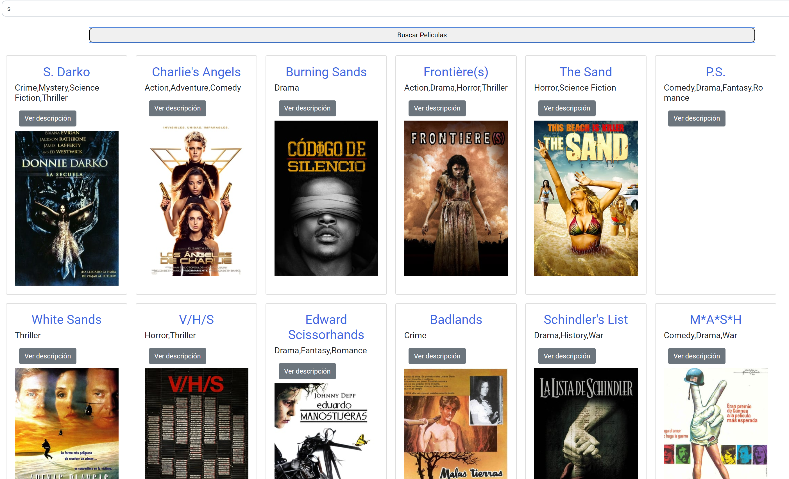

# GeeksHubs-P3---Buscador-de-Peliculas
Este proyecto es un buscador de peliculas, en el cual puedes ingresar la pelicula o peliculas que quieras ver y te mostrara el nombre, 
el género, la descripción y una foto de cada una.

## Tecnologías que he utilizado 🛠️

>Mi buscador de peliculas esta creado con HTML5 , CSS3,Layout( Flex ),Bootstrap, Responsive Design,
JavaScript y Axios.

### Demo del proyecto 

Puedes ver el proyecto en https://sofiapinilla.github.io/GeeksHubs-P3---Buscador-de-Peliculas/ .
 
 ---

#### Preview

 

---

Para ver la descripción dale click al botón y te la mostrará. Aquí puedes ver un ejemplo

[foto](imagenes/foto2.png) 

---
Hecho por [Sofía Pinilla](https://github.com/SofiaPinilla) 😊
